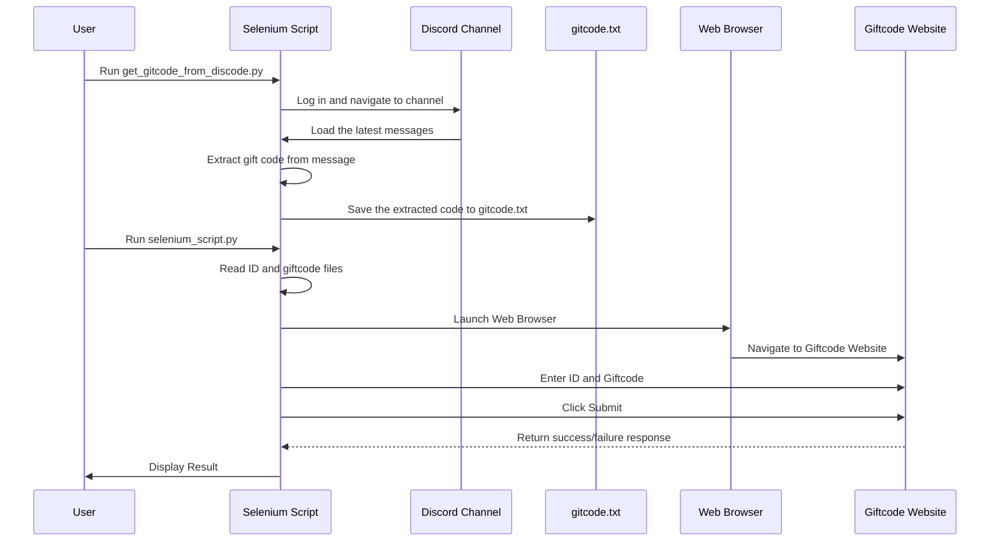

# Seleniumを使用したギフトコード自動送信

このプロジェクトは、Selenium WebDriverを使用して、ウェブサイトにギフトコードを自動的に送信するプロセスを自動化します。また、指定されたDiscordチャンネルから最新のギフトコードを自動的に取得し、それを使用して送信プロセスを行うことができます。

## 目次
- 前提条件
- インストール
- 使い方
- ファイル
- シーケンス図
- トラブルシューティング

## 前提条件

以下がシステムにインストールされていることを確認してください：

- Python 3.x
- Google Chrome（最新バージョン）
- ChromeDriver（Chromeのバージョンと一致している必要があります）

## インストール

1. **リポジトリをクローンします：**

```bash
git clone <リポジトリURL> cd <リポジトリディレクトリ>
```

2. **必要なPythonパッケージをインストールします：**

pipを使用して、必要な依存関係をインストールします：

```bash
pip install selenium
```

3. **ChromeDriverのパスを設定します：**

スクリプト内のchromedriverパスを更新します：

```python
chrome_driver_path = '/opt/homebrew/bin/chromedriver' # 必要に応じてこのパスを更新してください
```


## 使い方

### 1. IDとギフトコードファイルを準備します

- **id.txt**: ユーザーIDが1行ごとに記載されたテキストファイル。
- **gitcode.txt**: 適用するギフトコードが記載されたテキストファイル。

これらのファイルをスクリプトと同じディレクトリに配置してください。

### 2. Discordからギフトコードを取得する

`get_gitcode_from_discode.py` を使用して、指定されたDiscordチャンネルから最新のギフトコードを自動的に取得し、`gitcode.txt`に保存します。

**Discordのログイン情報を準備します**:

- **login_info.txt**: Discordのログイン情報を記載するテキストファイル。
- 構成例:
  - EMAIL=your_email@example.com
  - PASSWORD=your_password

以下のコマンドでPythonスクリプトを実行します：

```bash
python get_gitcode_from_discode.py
```

### 3. ギフトコード送信スクリプトを実行します

Discordからギフトコードを取得した後、`selenium_script.py` を実行して、IDに対してギフトコードを送信します。

以下のコマンドでPythonスクリプトを実行します：

```bash
python selenium_script.py
```

## ログ出力

スクリプトは、各ギフトコード送信の成功または失敗をコンソールに出力します。

## ファイル

- **get_gitcode_from_discode.py**: Discordチャンネルから最新のギフトコードを取得し、`gitcode.txt`に保存するスクリプト。
- **selenium_script.py**: ギフトコード送信プロセスを自動化するメインスクリプト。
- **login_info.txt**: Discordのログイン情報を記載するテキストファイル。
- **id.txt**: ユーザーIDが記載されたテキストファイル。
- **gitcode.txt**: ギフトコードが記載されたテキストファイル。

## シーケンス図

以下のシーケンス図は、ギフトコード取得および送信プロセスの手順を示しています。



## トラブルシューティング

- **ChromeDriverのバージョン不一致**: ChromeDriverのバージョンがインストールされているGoogle Chromeのバージョンと一致していることを確認してください。Chromeのバージョンはブラウザの設定で確認でき、対応するChromeDriverは[こちら](https://sites.google.com/chromium.org/driver/)からダウンロードできます。

- **ポップアップ処理**: スクリプトは「この報酬はすでに受け取られています」といったポップアップやエラーを処理します。サイトの構造が変更された場合、問題が発生する可能性がありますので、その際は修正が必要です。

- **タイムアウト**: ページの読み込みが遅い場合などにスクリプトが失敗することがあります。この場合、スクリプト内のスリープ時間を増やすと改善されることがあります。

